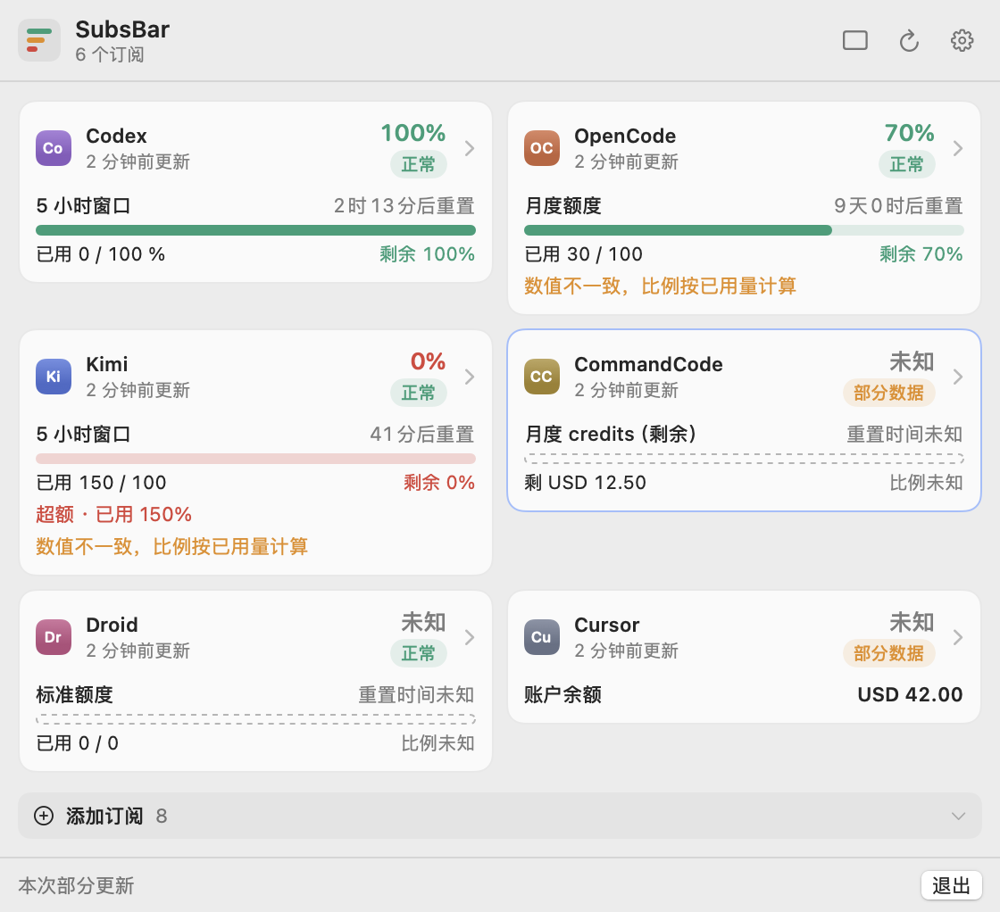
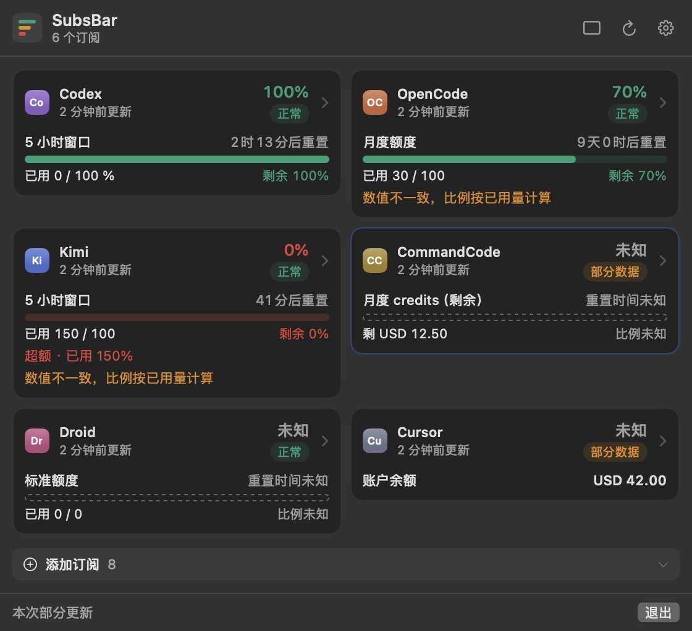
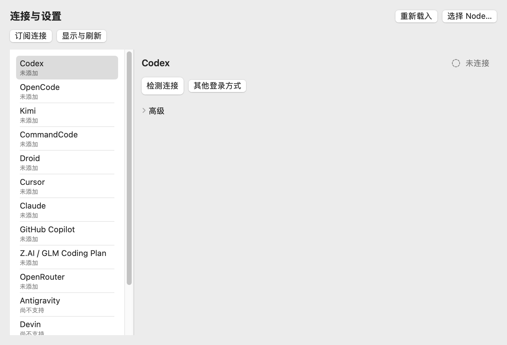

# SubsBar

English | [简体中文](README.md)

A macOS menu bar app plus an independently runnable Node data layer that
covers the AI coding subscriptions you actually pay for, showing real quota,
balance and reset times — with honest degradation when data is missing.

**Status: public preview in preparation (v0.1 first release: 13 providers
implemented; Claude is required, live admission not passed).** Six providers
are implemented with offline tests; seven more are implemented (defensive
parsers + offline tests) but have not been verified against real endpoints.
Community verification is welcome. Claude is a required target: offline
parsing is ready; live admission waits for applicable permission.







All screenshots are off-screen synthetic renders. Values and accounts are
synthetic, not live usage.

## Target providers (13 implemented; Claude required, live admission not passed)

| Provider | Status | Data source |
| --- | --- | --- |
| Codex | verified | OpenAI wham usage (community internal) |
| OpenCode Go | verified | `opencode.ai/zen/go/v1/usage` |
| Kimi Code | verified | `api.kimi.com/coding/v1/usages` |
| CommandCode | verified | `/alpha/whoami` + billing/usage |
| Factory Droid | verified | organization subscription usage |
| Cursor | verified | IDE state.vscdb + usage-summary RPC |
| Claude | **required / live admission not passed** | Offline parser ready; live admission awaiting applicable permission. Official CLI has no machine-readable exit; no secret reader, TUI scrape, or refresh consumption |
| GitHub Copilot | implemented (unverified) | `copilot_internal/user` (community) |
| Z.AI / GLM Coding Plan | implemented (unverified) | quota/limit (community, region required) |
| OpenRouter | implemented (unverified) | `/api/v1/key` (official) |
| Antigravity | implemented (unverified) | `agy /usage` (defensive parser) |
| Devin | implemented (unverified) | web org quota (defensive parser, needs organizationId) |
| Grok Build | implemented (unverified) | `cli-chat-proxy.grok.com/v1/billing` (defensive parser) |
| Ollama Cloud | implemented (unverified) | signed `GET /api/usage` (OpenSSH Ed25519); admission pending; `OLLAMA_API_KEY` is not quota |

> The "implemented (unverified)" seven: response structures are defensively
> implemented, but the maintainer has no subscription for them and they have
> not been exercised against real endpoints — field names may differ.
> Community contributors with a real subscription are welcome to verify (see
> `docs/providers/<id>.md` and the `pending-verification` annotations).
> Claude is a required target, not a finished exclusion: live admission stays
> **blocked** (awaiting applicable permission); the offline parser is ready.
> Existing sources cannot be treated as pending and turned on later.

Each provider's source grade, credential chain, window semantics and known
gaps: `docs/providers/<id>.md`.

## Install (public preview)

Source + external Node ≥ 22. No signed/notarized DMG.

1. Install Node.js ≥ 22.
2. Clone, then `node core/cli.mjs registry --json` to see connectable
   providers; enable one via config (see [docs/configuration.md](docs/configuration.md)).
3. Native app: see [docs/installation.md](docs/installation.md)
   (Swift 6 / SwiftPM, `swift build` + `./build-app.sh`).

## Semantics that matter

Different providers expose different fields; SubsBar never invents data:

- Remaining-only windows show "remaining" without an invented denominator.
- Unset or missing resets are "unknown"; crossed resets show "waiting for
  update", never auto-refill.
- Over-limit values are preserved verbatim; only drawing clamps to 0–100%.
- `0` and "unknown" are strictly different; different units are never summed.
- Cache ≤10 min is fresh, >10 min stale, ≥24 h expired (grayed icon).

## Disclaimer

SubsBar is an independent community project with no affiliation with or
endorsement from the listed vendors. It only displays account usage, limits
or balances from the data sources you choose; data may be delayed, missing,
or stop working when services change — vendor consoles and bills are
authoritative. Some sources use undisclosed interfaces; read the provider
docs and applicable terms before enabling. SubsBar contains no functionality
for bypassing access controls or quota limits. Credentials stay on your
machine and are only used for the corresponding provider; nothing is uploaded
to project servers. Provided "as is" under LICENSE.

## Development

```sh
node test/edge.test.mjs          # data-layer edge tests
node test/droid-cursor.test.mjs  # provider contract tests
swift build --package-path macos-app
swift run --package-path macos-app CoreChecks
node scripts/check-public.mjs    # public hygiene scan
node scripts/check-docs.mjs      # docs cross-reference check
```

All offline tests use synthetic fixtures. See LICENSE (MIT) and
THIRD_PARTY_NOTICES.md for the ported-parser ledger.

Docs: [architecture](docs/architecture.md) ·
[configuration](docs/configuration.md) · [installation](docs/installation.md) ·
[data sources](docs/data-sources.md) · [credential security](docs/credential-security.md) ·
[migration](docs/migration.md) · [contributing](CONTRIBUTING.md)
